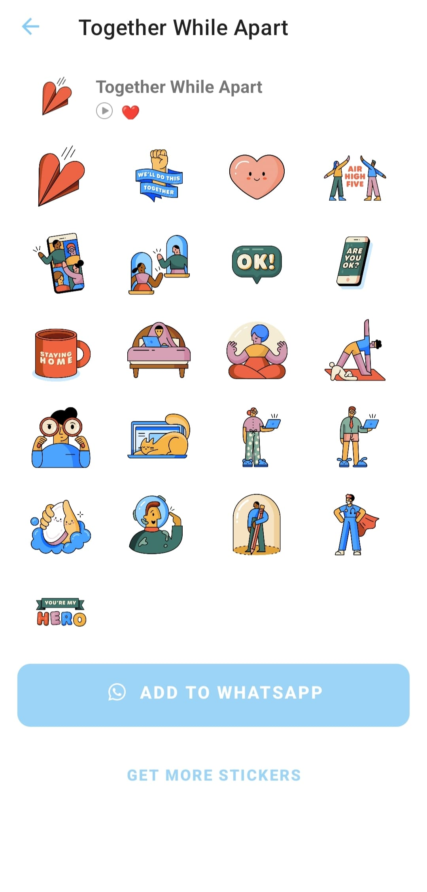

# Sticker Android

An Android app to add sticker packs to WhatsApp or WhatsApp Business.

## Tech Stacks
- Java

## Features
- Support static and animated stickers
- See list of characters

## How to use this repo

- Open the project in Android Studio
- Put your sticker images in `app/assets` folder
- Update the `app/assets/contents.json` file
- Update the app icon and splash image
- Update the app name

## IMPORTANT !!!

This app is for learning purpose only! Do not submit it to Play Store!

## Screenshots

Splash Screen

Main Page

Sticker Detail Page

About Page

